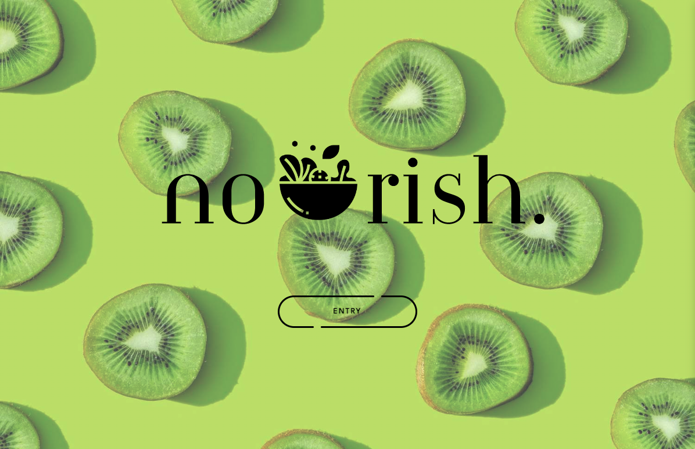
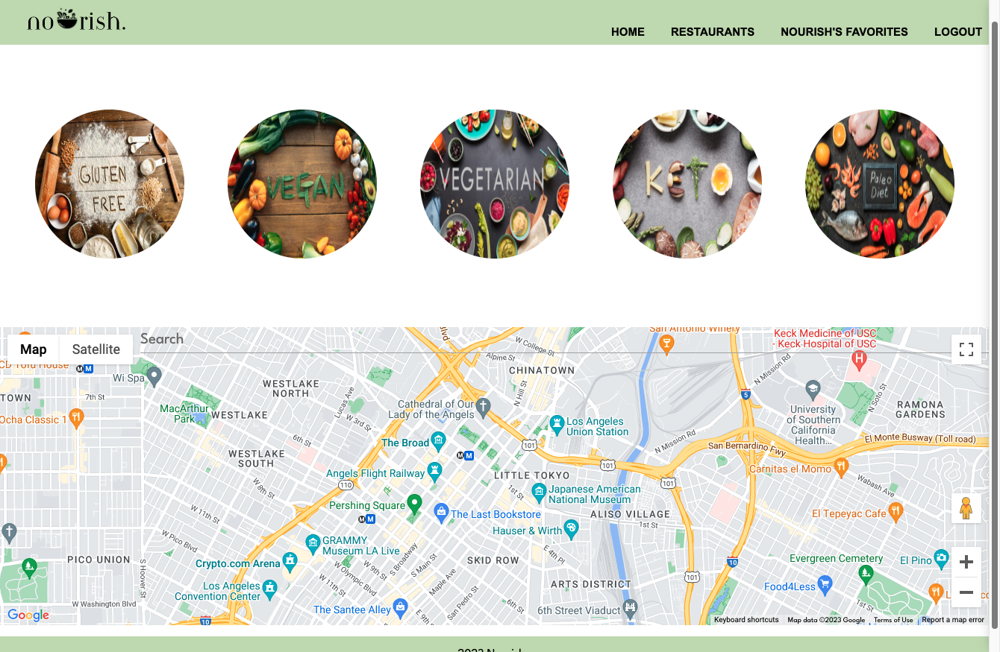
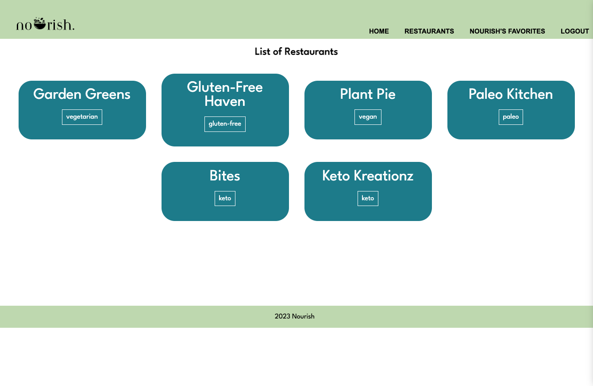
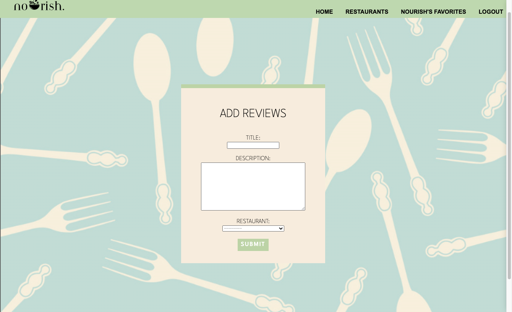

#### Nourish
___

“Nourish” is designed to help users find restaurants that cater to their specific dietary restrictions. Whether you're gluten-free, vegan, or have any other dietary needs, Nourish can help you find restaurants that offer meals that suit your preferences

##### Features
- Create a user account to save favorite restaurants
- Search for restaurants based on dietary restrictions or preferences
- CRUD functionality. Be able to create, read, and delete reviews to restaurants
- Clicking restaurant categories will bring users to list of filtered restaurants
- Implemented Google Place ID Finder API to display google maps

#### Screenshot
___

#### Technologies Used
___

 

 

 

 

 

 

 

#### Getting Started
___
<a href="https://trello.com/b/eYHTJpoM/nourish">Project Planning</a>

<a href="https://n0urish.herokuapp.com/">Deployed App (Nourish)</a>

#### Next Steps
___
- Full implementation of Google Places API
- Working filter search results by location, price, and cuisine
- Allow users to log dietary preferences and allergies, so that application can suggest restaurants to users
- Business Owner Tools: Business owners can claim their business on the app, respond to reviews, and access analytics and insights to help improve their online presence